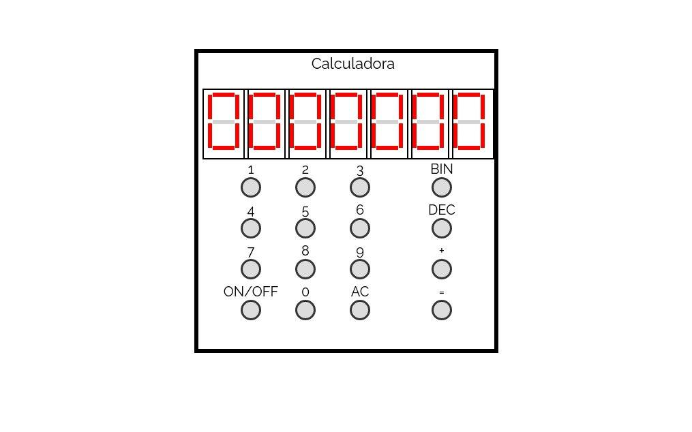
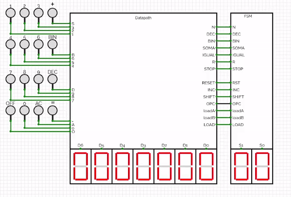

<h1 align="center">
  <br>
  <a href="#"></a>
  <br>
  Electronic Calculator 
  <br>
</h1>

Calculadora eletrônica feita no simulador [Circuit Verse](https://github.com/CircuitVerse/CircuitVerse), realiza soma de 2 números de 0 a 99, conversão bin2dec e dec2bin. A versão online se encontra [aqui](https://circuitverse.org/users/49107/projects/calculadora-ad7278e6-57d8-452e-be27-1401192e01a2)



## Funcionamento Datapath + FSM


## Máquina de estados

A máquina de estados foi feita usando o simulador [Digital v0.24](https://github.com/hneemann/Digital). Para ver o arquivo, basta abrir o arquivo [maquina.fsm](maquina.fsm) com este programa.


Para executar o programa, é apenas necessário um Java Runtime Environment (pelo menos JRE 8), na pasta [Digital](Digital) já tem a versão do programa utilizado. Para executar:

```bash
cd Digital
java -jar Digital.jar
```

Após isso, vá em `Análises` > `Máquina de Estados Finito` e importe o arquivo [maquina.fsm](maquina.fsm).

> A máquina de estados pode ser melhorada, poderia ser evitado diversos estados.

## Contribuindo

Pull requests são sempre bem vindos, posso ter esquecido de alguma coisa, ou me passado em algo. Se for uma mudança grande, abre uma Issue antes pra gente discutir as mudanças. Obrigado!

## Licença

[MIT License](LICENSE)
